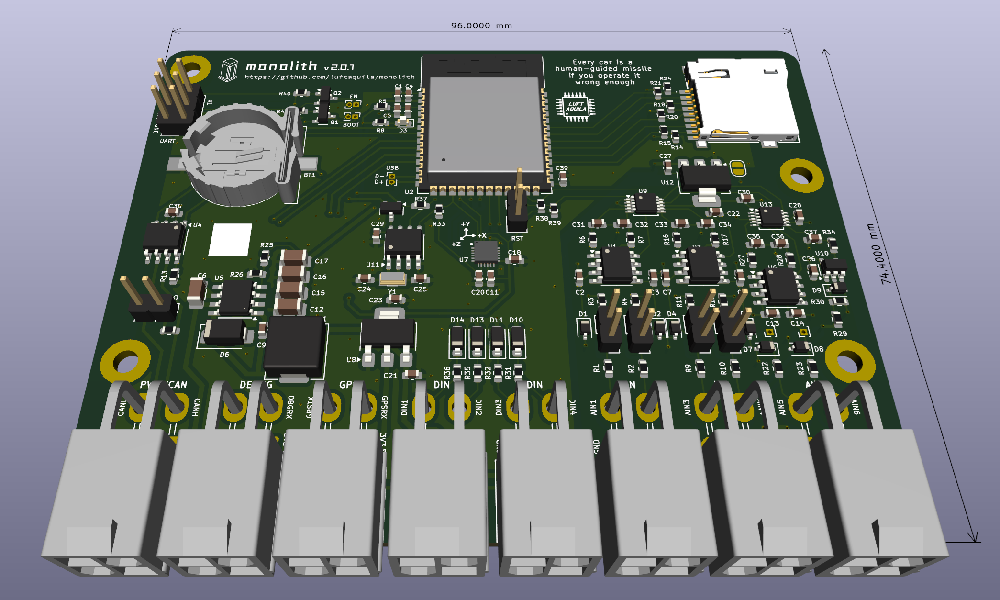
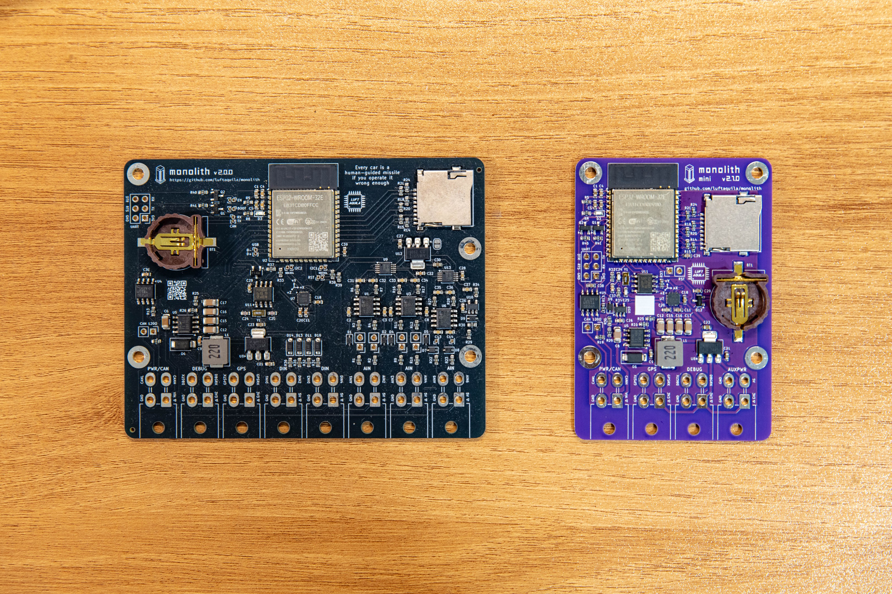

# GGOOLCHA Telemetry System


DIY wireless data logging platform for Team GGOOLCHA


## Features

* 📡 Full wireless support
   * Real-time telemetry
   * Download recorded data 
   * Transmit User Events
   * Transmit CAN messages
   * Configure device (e.g. CAN bit rate)

* 📀 Up to 100 Hz data rate with various signals
   * 1x CAN 2.0(A/B)
   * 1x External GPS
   * 1x Internal 6-axis Accelerometer & Gyroscope
   * 4x Digital input channels
   * 6x Analog input channels
   * 1x Power supply voltage sensor
   * 1x Chip temperature sensor

* 💡 Customizable web-based data analysis tool
* 🍺 Fully Open-source & Open-hardware under the Beerware license

## Preview

[Web Control Hub](https://v2.monolith.luftaquila.io) for live telemetry, data viewer and device/ui configurations.





## Documentation

[Full documentation](https://v2.monolith.luftaquila.io/docs) for DIY and usage details.

## Others

The name of the project was inspired by Arthur C. Clark's novel `2001: A Space Odyssey`.

## Sponsors


The prototype PCBs for the Monolith v1, v2, and v2 mini were sponsored by [PCBWay](https://www.pcbway.com/).

For the detailed review of the manufactured PCB, see [here](https://v2.monolith.luftaquila.io/docs/#sponsor).

### Individuals

<!-- sponsors --><a href="https://github.com/"></a><!-- sponsors -->

## 한계
현재는 stm32 -> esp32 -> mqtt 브로커 -> 서버 -> 프론트
stm32 -> esp32간 통신방식은 서버와 무관

JSON payload로 전달받을 경우
서버 JSON parser를 만들면 서버수정이 불필요할수도 있겠으나
 * JSON자체가 바이너리보다 무거움
 * JSON자체 오버헤드 존재등
 * WiFi자체 유선대비 지연/패킷손실 불규칙
 
 등등의 고빈도,고비용의 문제로 ESP32로는 바이너리 포맷이 적합하다고 판단.

따라서 현재로써는 Binary Payload방식을 이용할수밖에 없고 센싱을 금년과 다르게 할 경우 서버쪽 코드(protocol.js) 수정 불가피.

금년도에 사용한 ESP32의 경우 대역폭이 2.5GHZ로 낮았기때문에 호환성 최대화를 이용하여 아이폰 핫스팟이용(교내 와이파이 대역폭 5GHZ라 이용불가)

{2026년 3기 기준}

## Monolith v2 대비 변경사항
실시간 모니터링이 아닌 실시간 로깅을 목표로 했기때문에

브라우저가 MQTT브로커에 pub/sub클라이언트로 직접 접속하는 구조에 데이터 write가능한 상시 프로세스 추가구현(MQTT Logger)
시계열 DB인 influxDB 추가 구현및 운영.

다음 기수 이용을 고려하여 로컬보단 클라우드(AWS) 단일인스턴스내에 배포

deploy.yml 추가를 통해 CI/CD 구현. (GitHub 수정 즉시 서버 반영)  

센싱을 금년과 다르게 할 경우 (protocol.js)의 수정이 불가피하기에 수정의 편리함을 위해 기존에 하드 코딩되어있던 부분을 FIELD_SCHEMA 구조로 리팩토링
(필드의 추가/삭제의 경우 FIELD_SCHEMA만 변경하면 됨)

## 인프라 구축 과정


## LICENSE

For non-commercial use only:

```
"THE BEERWARE LICENSE" (Revision 42):
LUFT-AQUILA wrote this project. As long as you retain this notice,
you can do whatever you want with this stuff. If we meet someday,
and you think this stuff is worth it, you can buy me a beer in return.
```

<br>

<picture>
  <source media="(prefers-color-scheme: dark)" srcset="https://api.star-history.com/svg?repos=luftaquila/monolith&type=Date&theme=dark" />
  <source media="(prefers-color-scheme: light)" srcset="https://api.star-history.com/svg?repos=luftaquila/monolith&type=Date" />
  
</picture>
